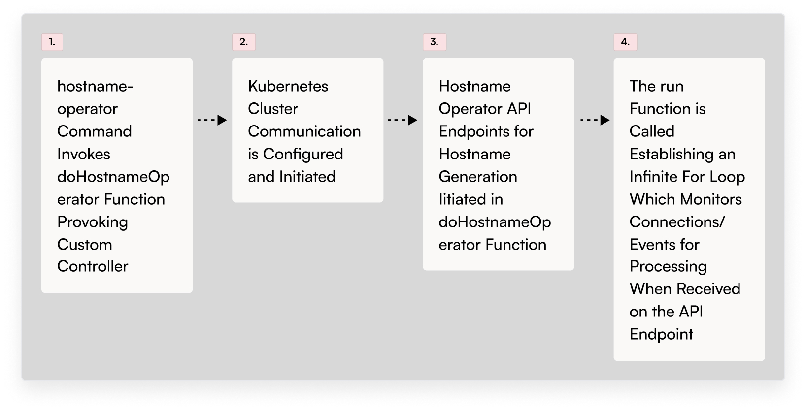

Not yet completed

## Pre-Requisites

A basic understanding of Kubernetes Custom Operator building and code structure is necessary to fully understand the concepts covered in our review of the Akash Provider's Hostname Operator. Suggested reviews of Kubernetes Custom Operators are provided in the [Akash Operator Overview](/docs/akash-provider-operators/akash-operator-overview/akash-operator-overview/) section.

## Visualization

> Use the visualization coupled with the Code Review section for correlated code deep dive


## Code Review

#### 1). Types Used for Customer Resource Definition

The Go structs that define the Kubernetes Custom Resource Definition for the Hostname Operator are located in the `pkg/apis/akash.network/v2beta1` directory. The Hostname Operator CRD specifically exists in the `types.go` file.

> [Source code reference location](https://github.com/akash-network/provider/blob/e7aa0b5b81957a130f1dc584f335c6f9e41db6b1/pkg/apis/akash.network/v2beta1/types.go)

Per typical Kubernetes CRD definition a `ProviderHostSpec` defines the schema for the Hostname Operator. And `ProviderHostStatus` defines the values delivered in the response to a custom resource CRUD event.

With this definition we will extend the Kubernetes API for use with the Hostname Operator. When `code-generator` is run against the Go struct the necessary YAML file for applying the CRD to the Kubernetes cluster will be generated and as detailed in the next section.

```
type ProviderHostStatus struct {
	State   string `json:"state,omitempty"`
	Message string `json:"message,omitempty"`
}

type ProviderHostSpec struct {
	Owner        string `json:"owner"`
	Provider     string `json:"provider"`
	Hostname     string `json:"hostname"`
	Dseq         uint64 `json:"dseq"`
	Gseq         uint32 `json:"gseq"`
	Oseq         uint32 `json:"oseq"`
	ServiceName  string `json:"service_name"`
	ExternalPort uint32 `json:"external_port"`
}
```

#### 2). CRD YAML Files Created via Code-Generator

The YAML files to create the Custom Resource Definition (CRD) within Kubernetes is auto-generated by `code-generator` using the Go struct definition into this file:

> pkg/apis/akash.network/crd.yaml

> _**NOTE**_ - along with the generation of the YAML file for CRD application on the provider Kubernetes cluster, code-generator additionally used deep-copy to scaffold the files created in the `provider/pkg/client` directory. The code-generator files scaffolded into the clientset, informers, and listers subdirectories should not be manually edited but instead are spawned via the definitions in the CRD definition file (I.e. the ProviderHostSpec struct).

#### 3). Cobra Registration of "hostname-operator" Command

Within the `hostname_operator.go` file the definitions of the customer controller are defined. &#x20;

> /provider/operator/hostnameoperator/hostname_operator.go

The `hostname_operator.go` file registers a Cobra command and when executed - via `provider-services hostname-operator` - the Hostname custom controller is initialized.

```
func Cmd() *cobra.Command {
	cmd := &cobra.Command{
		Use:          "hostname-operator",
		Short:        "kubernetes operator interfacing with k8s nginx ingress",
		SilenceUsage: true,
		RunE: func(cmd *cobra.Command, args []string) error {
			return doHostnameOperator(cmd)
		},
	}
```

Note the `RunE` invoke the `doHostnameOperator` function which will be reviewed as we continue into discussion of custom controller logic.

#### 4). Operator Command Flag Registration

Note the Cobra command flag registration in the Cmd function:

```
	operatorcommon.AddOperatorFlags(cmd, "0.0.0.0:8085")
	operatorcommon.AddIgnoreListFlags(cmd)
	err := providerflags.AddKubeConfigPathFlag(cmd)
```

The referenced `operatorcommon` path pulls in command flags from `provider/oerator/operatorcommon/operator_flags.go`. Amongst the flags enabled on the `provider-services hostname-operator` command is the --listen which allows the specification of a HTTP endpoint address/port of the operator.

By default and without explicitly calling the `--listen` flag, the hostname-operator will listen on all local interfaces (0.0.0.0) and port 8085 based on the default established on the Cobra command flag registration arguments.

Within `operatorcommon` this specific flag - along with other command operator flags - are registered via these functions (Listen Address flag example):

```
	cmd.Flags().String(providerflags.FlagListenAddress, defaultListenAddress, "listen address for web server")
	if err := viper.BindPFlag(providerflags.FlagListenAddress, cmd.Flags().Lookup(providerflags.FlagListenAddress)); err != nil {
		panic(err)
	}
```

#### 5). Custom Controller Logic

The Hostname Operator custom controller logic is located in the Go file `provider/operator/hostnameoperator/hostname_operator.go`. This is the same file that the `hostname-operator` Cobra command is registered within and which was covered in the previous section.

> _**NOTE**_ - When a container image is generated and which implements the logic within this file, a Kubernetes deployment may be created to host the controller.

Our code review will detail the mechanics involved in the controller's reconciliation of Desired and Actual states.

> [Source code location](https://github.com/akash-network/provider/blob/main/operator/hostnameoperator/hostname_operator.go)

As the implementation details of the Hostname Operator custom controller is a rather dense topic, the following sections have been created. The Visual High Level Representation is sufficient for a quick understanding of the mechanics. While the Controller Deep Dive section goes into detail at a code level.

### Hostname Controller - Visual High Level Representation



### Hostname Controller - Deep Dive
