Akash Console Tool is a web based application which simplifies the deployment process on the Akash Network. Post deployment the tool provides a dashboard to view the status and details of workloads. The dashboard also has the ability to perform administrative tasks including closing the deployment, updating the deployment, redeploying, and increasing the funding available to the deployment.

This guide will cover the following topics:

- [Akash Console Access](#akash-console-access)
- [Minecraft Deployment Example](#minecraft-deployment-example)
- [Manage Deployments](#manage-deployments)
- [Define a custom RPC node](#custom-rpc-node)

### Akash Wants to Spotlight Your Work

Have an idea for a project to deploy on Akash? Already working on a project? Maybe you’ve already deployed a project (or many projects!) to the network?

We love seeing what our community is building. Once your deployment is live, head over to our Discord and share the details of your app in our [Deployments channel](https://discord.com/channels/747885925232672829/771909909335506955) and tag @Admin.

Once you share your app, someone from the Akash team may reach out to spotlight your app across our newsletter, blog, and social media.

This is a great opportunity to connect with the team at Akash Network and to spotlight your work for our world-class community.

## Akash Console Access

### **Before Getting Started**

The Keplr and Leap browser extensions must be installed and with sufficient funds (5 AKT minimum for a single deployment plus a small amount for transaction fees).

Follow our [Keplr Wallet](/docs/getting-started/token-and-wallets/#keplr-wallet) and [Leap Cosmos Wallet](/docs/getting-started/token-and-wallets/#leap-cosmos-wallet) guides to create your first wallet if necessary.

### **Akash Console Access**

The Akash Console web app is available via the following URL:

- [https://console.akash.network/](https://console.akash.network/)

## Keplr Account Selection

Ensure that an Akash account with sufficient AKT balance is selected in Keplr prior to proceeding with subsequent steps.

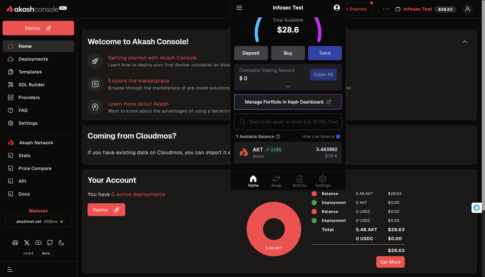

## Leap Account Selection

Ensure that an Akash account with sufficient AKT balance is selected in Leap prior to proceeding with subsequent steps.

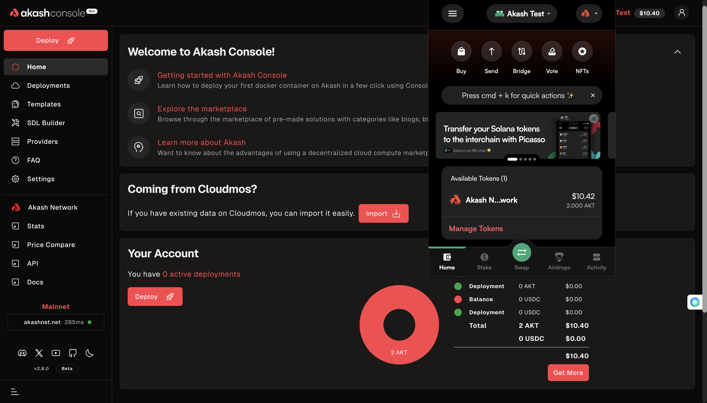

## Minecraft Deployment Example

In this section we will use Akash Console to launch an example Minecraft deployment on the Akash Network. You can follow the same process for any other workload so long as it is containerized and you have an appropriate SDL.

#### **STEP 1 - Create the Deployment**

- From the Dashboard/primary pane click the `CREATE DEPLOYMENT` button

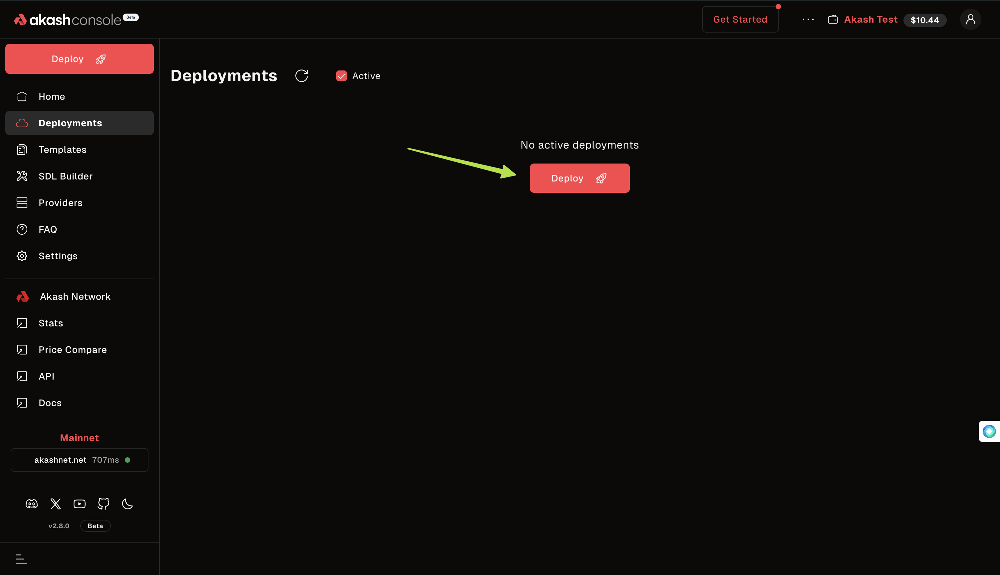

#### **STEP 2 - Create Certficate**

- A number of checks are performed to ensure necessary funds and certificates are available to launch a deployment.
- If this is your first deployment with Akash Console a `CREATE CERTIFICATE` prompt will be displayed. Select the `CREATE CERTIFICATE` button and accept transaction fee prompt from Keplr to proceed.

**STEP 3 - Choose Deployment Template**

- The tool provides several sample templates launch of popular applications
- Select the `Minecraft` template for our initial deployment

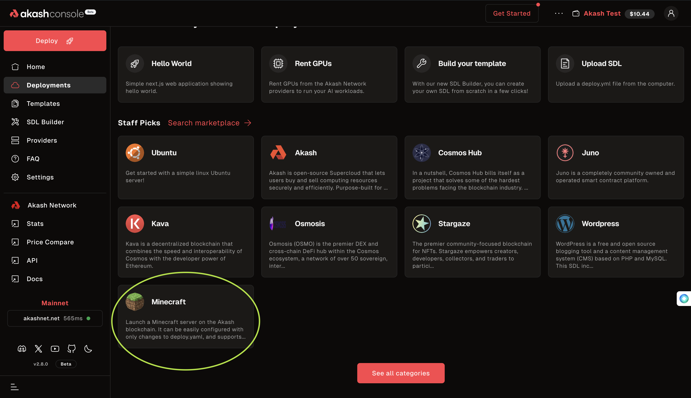

#### **STEP 4 - Proceed with Deployment**

- At this stage we could review/customize the Akash SDL deployment template if desired but in this example we will proceed with the default settings and by pressing the `DEPLOY` button

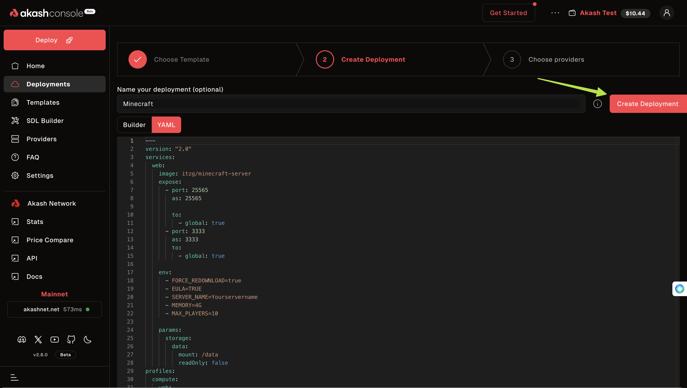

#### **STEP 5 - SDL Verification**

- Screen will appear which provides an additional opportunity to customize the SDL but we will again proceed with no edits by pressing the `CREATE DEPLOYMENT` button
- Subsequently accept the Deployment Deposit pop up which specifies that 5AKT will be placed into an escrow account for deployment cost and then the Keplr transaction fee prompt

#### **STEP 6 - Review/Accept Bid**

- After a minute or so a list of bids will display.&#x20;
- Select the most affordable, preferred provider and then press `ACCEPT BID`

> _**NOTE**_ - list of bids and providers may be different in your deployment

- Accept the Keplr transaction fee prompt to proceed

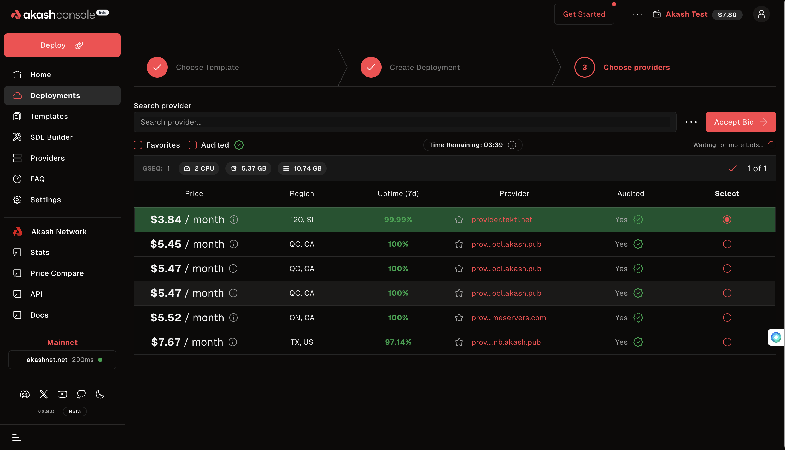

#### **STEP 7 - Post Deployment**

- While the deployment is becoming active the `LOGS` tab is displayed.
- When the deployment appears to be complete, select the `LEASES` tab.
- The `LEASES` tab confirms the successful deployment of our example Minecraft application

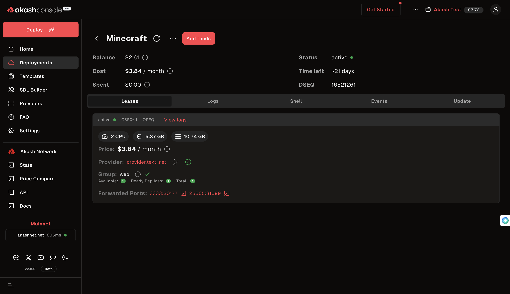

## Manage Deployments

There are a several important management operations you can do with the Akash Console tool including:

- [Add funds to existing deployment’s Escrow Account](#add-funding-to-active-deployment)
- [Close an active deployment](#close-active-deployment)

### **Deployment Dashboard Overview**

- To get an overview of what you have deployed click the `Dashboard` button on the left hand navigation pane
- From the Active Deployments window you can see the resources that are dedicated to each deployment.

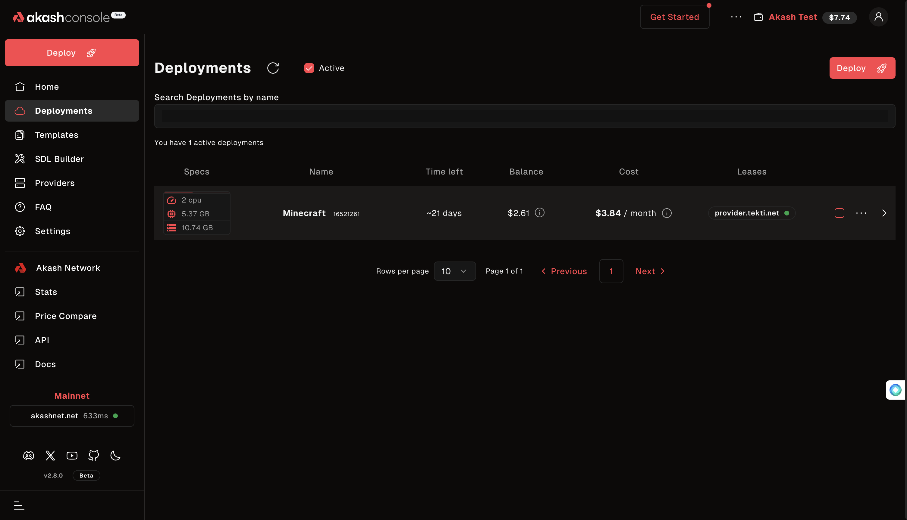

### **Add Funding to Active Deployment**

- If your escrow for a deployment is running low you will need to add some funds.
- Within the `Dashboard` pane, isolate the deployment of interest, select the `...` option to expand options, and select `Deposit`

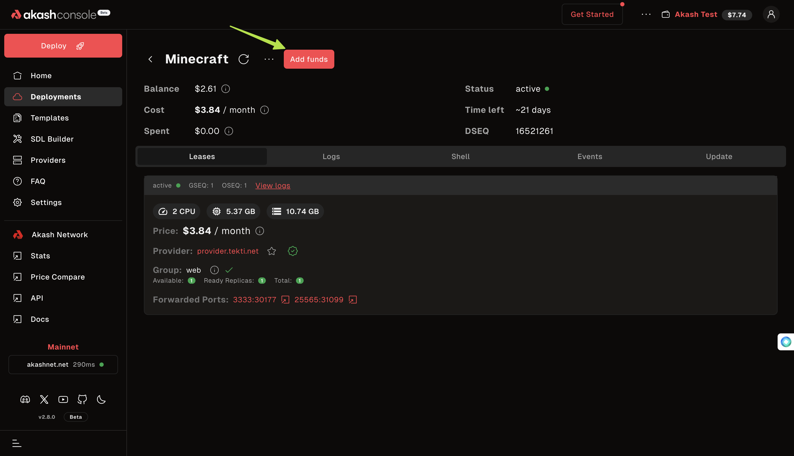

- A dialog box will pop up allowing you to add tokens to the deployment’s escrow account
- Select the `DEPOSIT` button once you have put in the correct amount
- As always you must confirm the gas fees and transaction to the blockchain by clicking “APPROVE”

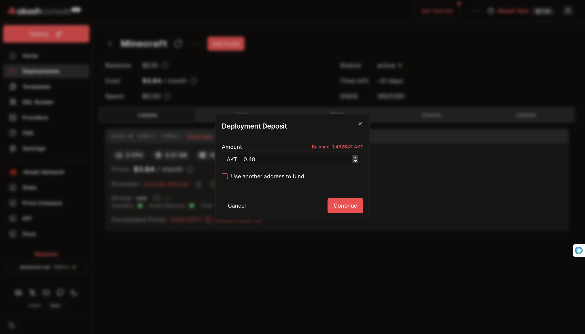

- Notice the balance change in the escrow account for the deployment

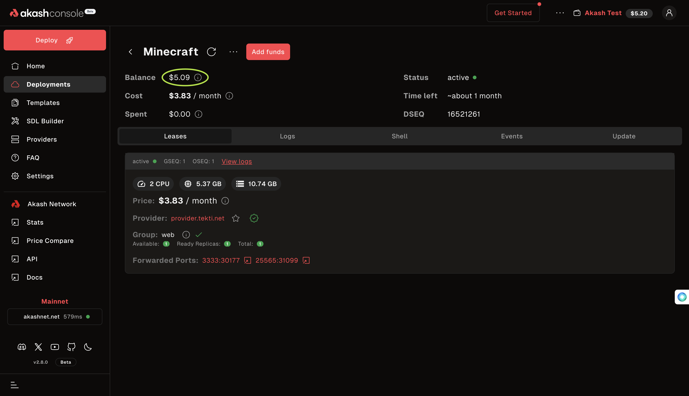

### **Close Active Deployment**

Closing a deployment is very simple.

- Visit the `Dashboard` pane and click the deployment you want to close
- Within the `Dashboard` pane, isolate the deployment of interest, select the `...` option to expand options, and select `Close`
- Confirm the transaction to the blockchain
- The deployment should now be removed from the list

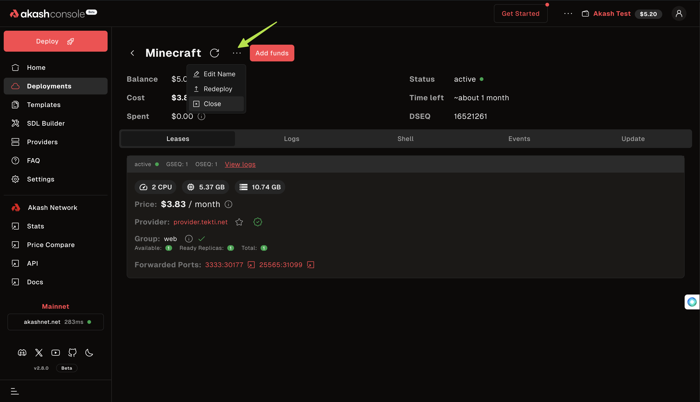

# Custom RPC Node

Specify a custom RPC or API node within Akash Console by using the steps outlined in this section.&#x20;

The custom node option can point to a RPC node we have created and manage ourselves. Or we can point to an alternative public RPC node that was not selected by Akash Console auto selection.

### STEP 1 - Enable Custom Node Use

- Begin by selecting the drop-down next to the current Node and then click the `Custom node`radio button

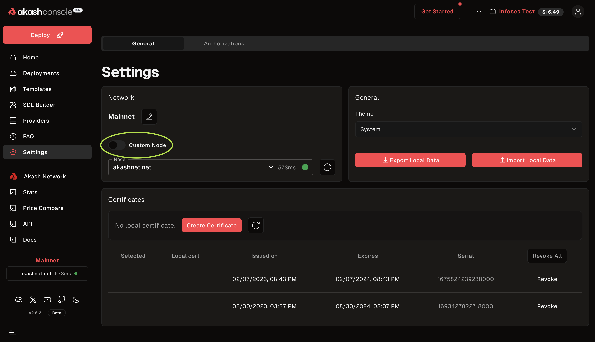

### STEP 2 - Edit the RPC and API Nodes

Press the `EDIT` button to enter the screen where we can enter our preferred nodes

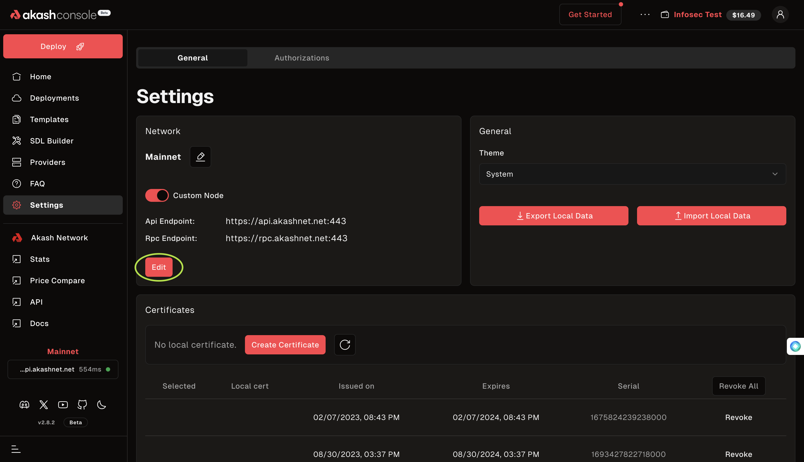

### STEP 3 - Specify Preferred RPC and API Nodes

Use the `Api Endpoint` and `Rpc Endpoint` fields to define your own managed nodes or preferred public nodes.\
\
If you do not maintain your own nodes and want to select from a list of popular public nodes, choose from the RPC node list [here](https://github.com/akash-network/net/blob/master/mainnet/rpc-nodes.txt) and the API node list [here](https://github.com/akash-network/net/blob/master/mainnet/api-nodes.txt).

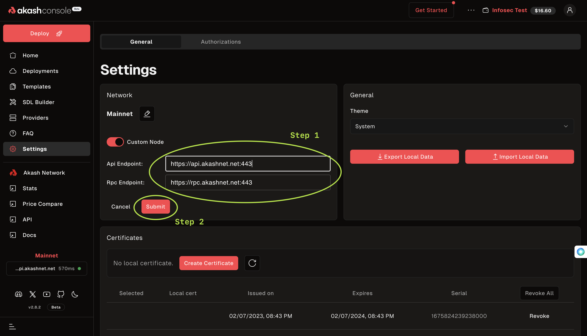
