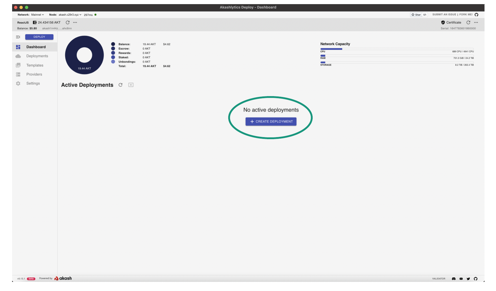
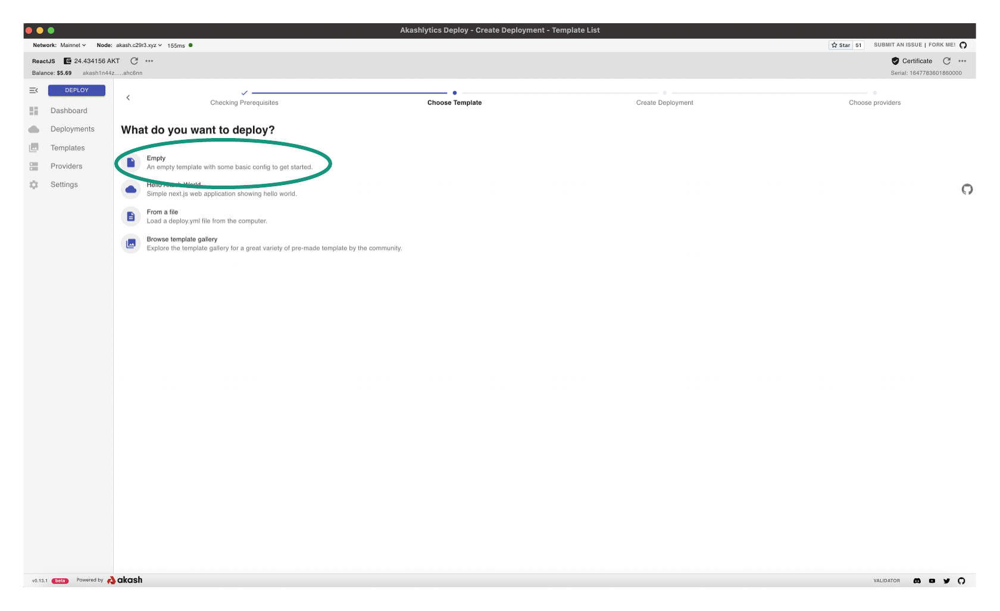
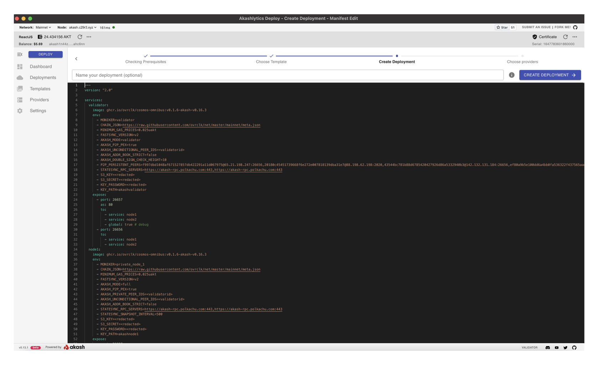

Building an Akash Validator is simplified via the use of Cosmos Omnibus and as detailed in this guide.

> _**NOTE**_ - using the procedures in this guide the Validator private key will be stored within the associated Akash deployment. Ensure that only known, trusted providers are used for such deployments. Additionally consider storing the private key outside of the deployment through the use of TMKMS which is documented [here](/akash-docs/docs/validators/akash-validator-with-tmkms-and-stunnel/).

The Akash Validator will be built with the following attributes:

- Two Sentry nodes will be created to protect the validator from distributed denial of service (DDOS) attacks
- The Akash Validator will sit behind the Sentry nodes and will not be directly exposed to the internet
- The Sentry nodes and the Akash Validator will launched on the Akash Network as deployments
- This guide will detail the launch of the deployments via the Cloudmos Deploy tool for ease

### Sections within this Guide

[STEP 1 - Cloudmos Deploy Review](#cloudmos-deploy-review)

[STEP 2 - FileBase Buckets](#filebase-buckets)

[STEP 3 - Akash SDL Review](#akash-sdl-review)

[STEP 4 - Cloudmos Initial Deployment](#cloudmos-initial-deployment)

[STEP 5 - Edit SDL with Known IDs](#edit-sdl-with-known-ids)

[STEP 6 - Redeploy Validator and Sentries with Cloudmos](#redeploy-validator-and-sentries-with-cloudmos)

## Cloudmos Deploy Review

While all steps within this guide could be accomplished via the Akash CLI, we will use the Cloudmos Deploy tool as it has become our most popular deploy tool.\
\
If you have not installed Cloudmos prior and/or are not overly familiar with the app, please review our [Cloudmos Deploy documentation](broken-reference) before getting started with the Validator build steps detailed in subsequent sections.

## FileBase Buckets

The Omnibus framework used to build our Akash Validator will store the following info in a S3 bucket for re-use when a deployment is restarted. All data stored will be encrypted.

- _Validator's Private Key_
- _Node IDs_ - more detail on the use of these IDs later in this guide

### Bucket Creation

We recommend the use of [FileBase](https://console.filebase.com/) S3 buckets for this purpose. If you do not have a FileBase account, create a free account for this use.

Create the following buckets within FileBase for upcoming use in the Validator build.

- akashnode1
- akashnode2
- akashvalidator

### Access Keys

Visit the FileBase \`Access Keys\` menu option and capture the `KEY` and `SECRET` for use in subsequent steps.

## Akash SDL Review

Akash deployments are created using [Stack Definition Language (SDL)](../../readme/stack-definition-language.md) files that serve as the recipe for your deployments. In this section we detail the Omnibus SDL used for the Akash Validator deployment.

### Akash Validator SDL Template

The SDL template for the Akash Validator build is located in this [GitHub repository](https://github.com/akash-network/cosmos-omnibus/blob/master/_examples/validator-and-private-sentries/deploy.yml).

Copy the SDL located in the repository into a local editor for customizations covered in upcoming steps.

### Initial SDL Customizations

All SDL edits necessary are environment variable related. Within the SDL, we will only edit values within the `services` section and `env` subsections. All other segments of the SDL can be used from the template without need to edit.

#### Validator Service

- The first service listed in the SDL and which requires customization is the `validator` service
- Recommended `env` variable updates are detailed in the code block below
- **NOTE** - eventually we will need to additionally update the AKASH_UNCONDITIONAL_PEER_IDS variable. But at this point in the process these IDs - which are the IDs of the Sentry nodes - are not known. Based on this we will update this field later.

Update the following env variables with suggested values:

```
AKASH_P2P_PEX=true

P2P_PERSISTENT_PEERS=f997dbd1048af671527857db422291a11d067975@65.21.198.247:26656,20180c45451739668f6e272e007818139dba31e7@88.198.62.198:2020,43544bc781b88d6785420427926d86a5332940b3@142.132.131.184:26656,ef80a9b5e100dd6a4bb0fa536322f437565aad39@38.146.3.167:26656,aa01698ec0d8bb96398e89b57ecb08bcca50fa21@65.21.199.148:26636,d2643edd1b3dce6615bc9925e20122c44d2ff763@172.106.17.158:26656,30b8008d4ea5069a8724a0aa73833493efa88e67@65.108.140.62:26656,157f7c0e1363bea36a10bfae2a9127f5c6dd2991@18.220.238.235:26656,8e8e0282408001bc9dfd8bc3696ed2a5201245b0@168.119.190.132:26656,a8da9010d07b69894765cfd27b1eca62f1cb1d55@13.214.178.23:26656,be3a538cebb28e7224db10920bb7fe32456e1aad@116.202.244.153:26656,070b3c936e2995bc269a2981702b87de05411baa@148.251.13.186:28656,eeacfa49aa225f5232d0456bd3e4111be11b516e@65.108.6.185:26656,e18d9d0c1ad94d6394913fbf902c9fc0f38b369e@34.148.214.23:26656

STATESYNC_RPC_SERVERS=https://akash-rpc.polkachu.com:443,https://akash-rpc.polkachu.com:443

S3_KEY=<specify the key captured in FileBase>

S3_SECRET=<specify the secret captured in FileBase>

KEY_PASSWORD=<password of your choice that is used in encryption of files in FileBase>

KEY_PATH=akashvalidator
```

##### Example/Populated Variables

```
validator:
    image: ghcr.io/akash-network/cosmos-omnibus:v0.3.42-akash-v0.22.7
    env:
      - MONIKER=validator
      - CHAIN_JSON=https://raw.githubusercontent.com/akash-network/net/main/mainnet/meta.json
      - MINIMUM_GAS_PRICES=0.025uakt
      - FASTSYNC_VERSION=v2
      - AKASH_MODE=validator
      - AKASH_P2P_PEX=true
      - AKASH_UNCONDITIONAL_PEER_IDS=<node-1-id>,<node-2-id>...
      - AKASH_ADDR_BOOK_STRICT=false
      - AKASH_DOUBLE_SIGN_CHECK_HEIGHT=10
      - P2P_PERSISTENT_PEERS=f997dbd1048af671527857db422291a11d067975@65.21.198.247:26656,20180c45451739668f6e272e007818139dba31e7@88.198.62.198:2020,43544bc781b88d6785420427926d86a5332940b3@142.132.131.184:26656,ef80a9b5e100dd6a4bb0fa536322f437565aad39@38.146.3.167:26656,aa01698ec0d8bb96398e89b57ecb08bcca50fa21@65.21.199.148:26636,d2643edd1b3dce6615bc9925e20122c44d2ff763@172.106.17.158:26656,30b8008d4ea5069a8724a0aa73833493efa88e67@65.108.140.62:26656,157f7c0e1363bea36a10bfae2a9127f5c6dd2991@18.220.238.235:26656,8e8e0282408001bc9dfd8bc3696ed2a5201245b0@168.119.190.132:26656,a8da9010d07b69894765cfd27b1eca62f1cb1d55@13.214.178.23:26656,be3a538cebb28e7224db10920bb7fe32456e1aad@116.202.244.153:26656,070b3c936e2995bc269a2981702b87de05411baa@148.251.13.186:28656,eeacfa49aa225f5232d0456bd3e4111be11b516e@65.108.6.185:26656,e18d9d0c1ad94d6394913fbf902c9fc0f38b369e@34.148.214.23:26656
      - STATESYNC_RPC_SERVERS=node1,node2
      - S3_KEY=A397A7<redacted>
      - S3_SECRET=7ZHVFsE2<redaacted>
      - KEY_PASSWORD=Validator4Akash!#!
      - KEY_PATH=akashvalidator

```

#### Sentry Node #1 Service

- The second service listed in the SDL that requires customization is for the `node1` service.
- Recommended `env` variable updates are detailed in the code block below
- **NOTE** - eventually we will need to additionally update the `AKASH_PRIVATE_PEER_IDS` and `AKASH_UNCONDITIONAL_PEER_IDS` variables. But at this point in the process these IDs - which is the ID of the Validator node - is not known. We will update these fields later.

Update the following env variables with suggested values:

```
STATESYNC_RPC_SERVERS=https://akash-rpc.polkachu.com:443,https://akash-rpc.polkachu.com:443

S3_KEY=<specify the key captured in FileBase>

S3_SECRET=<specify the secret captured in FileBase>

KEY_PASSWORD=<password of your choice that is used in encryption of files in FileBase>

KEY_PATH=akashnode1
```

##### Example/Populated Variables

```
  node1:
    image: ghcr.io/akash-network/cosmos-omnibus:v0.3.42-akash-v0.22.7
    env:
      - MONIKER=private_node_1
      - CHAIN_JSON=https://raw.githubusercontent.com/akash-network/net/main/mainnet/meta.json
      - MINIMUM_GAS_PRICES=0.025uakt
      - FASTSYNC_VERSION=v2
      - AKASH_MODE=full
      - AKASH_P2P_PEX=true
      - AKASH_PRIVATE_PEER_IDS=<validatorid>
      - AKASH_UNCONDITIONAL_PEER_IDS=<validatorid>
      - AKASH_ADDR_BOOK_STRICT=false
      - STATESYNC_RPC_SERVERS=https://akash-rpc.polkachu.com:443,https://akash-rpc.polkachu.com:443
      - STATESYNC_SNAPSHOT_INTERVAL=500
      - S3_KEY=<redacted>
      - S3_SECRET=<redacted>
      - KEY_PASSWORD=<redacted>
      - KEY_PATH=akashnode1
```

#### Sentry Node #2 Service

- The third and final service list in the SDL that requires customization is for the `node2` service.
- Recommended `env` variable updates are detailed in the code block below
- **NOTE** - eventually we will need to additionally update the `AKASH_PRIVATE_PEER_IDS` and `AKASH_UNCONDITIONAL_PEER_IDS` variables. But at this point in the process these IDs - which is the ID of the Validator node is not known - and based on this we will update this field later.

Update the following env variables with suggested values:

```
STATESYNC_RPC_SERVERS=https://akash-rpc.polkachu.com:443,https://akash-rpc.polkachu.com:443

S3_KEY=<specify the key captured in FileBase>

S3_SECRET=<specify the secret captured in FileBase>

KEY_PASSWORD=<password of your choice that is used in encryption of files in FileBase>

KEY_PATH=akashnode2
```

##### Example/Populated Variables

```
  node2:
    image: ghcr.io/akash-network/cosmos-omnibus:v0.3.42-akash-v0.22.7
    env:
      - MONIKER=private_node_1
      - CHAIN_JSON=https://raw.githubusercontent.com/akash-network/net/main/mainnet/meta.json
      - MINIMUM_GAS_PRICES=0.025uakt
      - FASTSYNC_VERSION=v2
      - AKASH_MODE=full
      - AKASH_P2P_PEX=true
      - AKASH_PRIVATE_PEER_IDS=<validatorid>
      - AKASH_UNCONDITIONAL_PEER_IDS=<validatorid>
      - AKASH_ADDR_BOOK_STRICT=false
      - STATESYNC_RPC_SERVERS=https://akash-rpc.polkachu.com:443,https://akash-rpc.polkachu.com:443
      - STATESYNC_SNAPSHOT_INTERVAL=500
      - S3_KEY=<redacted>
      - S3_SECRET=<redacted>
      - KEY_PASSWORD=<redacted>
      - KEY_PATH=akashnode2
```

## Cloudmos Initial Deployment

The Akash validator build - using a Sentry architecture - requires that the Validator ID is known by the Sentry nodes. Additionally the Sentry node IDs must be known by the Validator. As these IDs are unknown prior to the build process - and are then stored for re-use in the S3 bucket during the build process - we must create an initial deployment, capture the necessary IDs, close the initial deployments, and launch anew the deployments with the IDs specified.

In this section we will create the initial deployments for ID captures.

### **Create Deployments via Cloudmos**

- Within the Cloudmos Deploy app, begin the process of creating a new deployment



- Select Empty Template for eventual entry of our custom SDL



- Copy and paste the SDL we created and edited prior
- Proceed thru steps of accepting necessary gas fees to create the deployment
- When prompted select the desired Provider to host the deployment and complete the deployment process



## Capture Validator and Sentry Node IDs

- Within the Cloudmos deployment shell tab - as shown in the depiction below - we can capture the necessary IDs for the eventual, permanent Akash Validator deployment
- Select the SHELL tab and select the `validator` instance from Service drop down
- Enter the command `akash tendermint show-node-id` in the command line entry box on the bottom of the display
- Copy the exposed ID for the validator to a text pad for use in a later step
- Repeat this same process to collect the IDs of node1 and node2 (same steps as above but change the Service drop down to the nodes)


### Close the Deployment

With the necessary IDs now captured, close the current deployment. As mentioned previously - we will use the IDs captured to create a permanent deployment in subsequent steps.

## Edit SDL with Known IDs

In this step we will revisit and edit our initial SDL file with the known Validator and Node IDs.

### Validator Service Update

- Update the following entry in the SDL under the Validator service

`AKASH_UNCONDITIONAL_PEER_IDS`

- Use the node1 and node2 IDs captured in the previous steps as the comma separated values of this variable
- Once populated this variable should appear as below in the greater section (example IDs shown and should be your own)

```
   validator:
    image: ghcr.io/akash-network/cosmos-omnibus:v0.3.42-akash-v0.22.7
    env:
      - MONIKER=validator
      - CHAIN_JSON=https://raw.githubusercontent.com/akash-network/net/main/mainnet/meta.json
      - MINIMUM_GAS_PRICES=0.025uakt
      - FASTSYNC_VERSION=v2
      - AKASH_MODE=validator
      - AKASH_P2P_PEX=true
      - AKASH_UNCONDITIONAL_PEER_IDS=c955c77516b4c6fc62406a63303395fc97662c1e,b3035d5dfbfeb359c716bcb714ab383e6b73a5fd
      - AKASH_ADDR_BOOK_STRICT=false
      - AKASH_DOUBLE_SIGN_CHECK_HEIGHT=10
      - P2P_PERSISTENT_PEERS=f997dbd1048af671527857db422291a11d067975@65.21.198.247:26656,20180c45451739668f6e272e007818139dba31e7@88.198.62.198:2020,43544bc781b88d6785420427926d86a5332940b3@142.132.131.184:26656,ef80a9b5e100dd6a4bb0fa536322f437565aad39@38.146.3.167:26656,aa01698ec0d8bb96398e89b57ecb08bcca50fa21@65.21.199.148:26636,d2643edd1b3dce6615bc9925e20122c44d2ff763@172.106.17.158:26656,30b8008d4ea5069a8724a0aa73833493efa88e67@65.108.140.62:26656,157f7c0e1363bea36a10bfae2a9127f5c6dd2991@18.220.238.235:26656,8e8e0282408001bc9dfd8bc3696ed2a5201245b0@168.119.190.132:26656,a8da9010d07b69894765cfd27b1eca62f1cb1d55@13.214.178.23:26656,be3a538cebb28e7224db10920bb7fe32456e1aad@116.202.244.153:26656,070b3c936e2995bc269a2981702b87de05411baa@148.251.13.186:28656,eeacfa49aa225f5232d0456bd3e4111be11b516e@65.108.6.185:26656,e18d9d0c1ad94d6394913fbf902c9fc0f38b369e@34.148.214.23:26656
      - STATESYNC_RPC_SERVERS=https://akash-rpc.polkachu.com:443,https://akash-rpc.polkachu.com:443
      - S3_KEY=<redacted>
      - S3_SECRET=<redacted>
      - KEY_PASSWORD=<redacted>
      - KEY_PATH=akashvalidator
```

### Node Service Update

- Update the following entries in the SDL under the node1 and node2 services

`AKASH_PRIVATE_PEER_IDS`

`AKASH_UNCONDITIONAL_PEER_IDS`

- Use the validator ID captured in the previous steps as the comma separated values of this variable
- Once populated these variables should appear as below in the greater section (example ID shown and should be your own)
- Only `node1` example shown. Identical updates should be made to the `node2` service as well.

```
  node1:
    image: ghcr.io/akash-network/cosmos-omnibus:v0.3.42-akash-v0.22.7
    env:
      - MONIKER=private_node_1
      - CHAIN_JSON=https://raw.githubusercontent.com/akash-network/net/main/mainnet/meta.json
      - MINIMUM_GAS_PRICES=0.025uakt
      - FASTSYNC_VERSION=v2
      - AKASH_MODE=full
      - AKASH_P2P_PEX=true
      - AKASH_PRIVATE_PEER_IDS=2d76800f5a149510229aadf480f8ec02ac6e5297
      - AKASH_UNCONDITIONAL_PEER_IDS=2d76800f5a149510229aadf480f8ec02ac6e5297
      - AKASH_ADDR_BOOK_STRICT=false
      - STATESYNC_RPC_SERVERS=https://akash-rpc.polkachu.com:443,https://akash-rpc.polkachu.com:443
      - STATESYNC_SNAPSHOT_INTERVAL=500
      - S3_KEY=<redacted>
      - S3_SECRET=<redacted>
      - KEY_PASSWORD=<redacted>
      - KEY_PATH=akashnode1
```

## Redeploy Validator and Sentries with Cloudmos

Within Cloudmos Deploy using the identical steps covered in the initial Validator deployment but use the updated SDL within IDs populated

## Validator Verifications

### Confirm Your Validator is Running

#### Ensure Validator Sync

- Ensure that the field \`catching_up\` is false and that the latest block corresponds to the current block of the blockchain
- Execute this verification on both the sentry and validator nodes

```
akash status
```

##### Example Output when Validator is in Sync

```
{"NodeInfo":{"protocol_version":{"p2p":"8","block":"11","app":"0"},"id":"136d67725800cb5a8baeb3e97dbdc3923879461e","listen_addr":"tcp://0.0.0.0:26656","network":"akashnet-2","version":"0.34.19","channels":"40202122233038606100","moniker":"cznode","other":{"tx_index":"on","rpc_address":"tcp://0.0.0.0:26657"}},"SyncInfo":{"latest_block_hash":"4441B6D626166822979597F252B333C131C1DCB2F0467FF282EF0EAA3936B8CC","latest_app_hash":"1ED64AE88E5CFD53651CD2B6B4E970292778071C8FBE23289393B4A06F57975F","latest_block_height":"8284780","latest_block_time":"2022-10-31T15:28:17.565762161Z","earliest_block_hash":"E25CE5DD10565D6D63CDA65C8653A15F962A4D2960D5EC45D1DC0A4DE06F8EE3","earliest_app_hash":"19526102DDBCE254BA71CC8E44185721D611635F638624C6F950EF31D3074E2B","earliest_block_height":"5851001","earliest_block_time":"2022-05-12T17:51:58.430492536Z","catching_up":false},"ValidatorInfo":{"Address":"354E7FA2BF8C5B9C0F1C80F1C222818EC992D377","PubKey":{"type":"tendermint/PubKeyEd25519","value":"1+dVHZD7kfqnDU6I+bKbCv4ZE1LPieyMH+mwsOowhqY="},"VotingPower":"0"}}
```

#### Confirm Validator's Staking Status

##### Template

```
akash query staking validator <akashvaloper-address>
```

##### Example

```
akash query staking validator akashvaloper16j3ge9lkpgtdkzntlja08gt6l63fql60xdupxq
```

##### Example Output

- Status will display as \`BOND_STATUS_UNBONDED\` after initial build

```
commission:
  commission_rates:
    max_change_rate: "0.010000000000000000"
    max_rate: "0.200000000000000000"
    rate: "0.100000000000000000"
  update_time: "2022-10-31T15:24:25.040091667Z"
consensus_pubkey:
  '@type': /cosmos.crypto.ed25519.PubKey
  key: 1+dVHZD7kfqnDU6I+bKbCv4ZE1LPieyMH+mwsOowhqY=
delegator_shares: "1000000.000000000000000000"
description:
  details: ""
  identity: ""
  moniker: cznode
  security_contact: ""
  website: ""
jailed: false
min_self_delegation: "1"
operator_address: akashvaloper1jy7ej9t6r8q5dyjrst88nt9rjgkdltgx97wfvd
status: BOND_STATUS_UNBONDED
tokens: "1000000"
unbonding_height: "0"
unbonding_time: "1970-01-01T00:00:00Z"
```

#### Active Set Confirmation

Your validator is active if the following command returns anything

> _**NOTE**_ - this command will only display output of your validator is in the active set

```
akash query tendermint-validator-set | grep "$(akash tendermint show-validator)"
```
