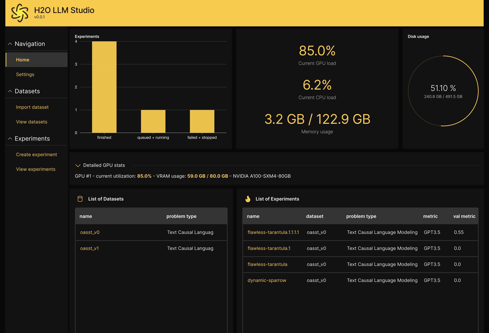

Here’s a comprehensive guide to deploying the H2O LLM on Akash using your SDL template. The guide covers both the Akash CLI and Akash Console methods.

## Prerequisites

1. **Akash Wallet**: Ensure you have an Akash wallet with sufficient $AKT to cover deployment costs and fees.

2. **Akash CLI**: Install the Akash CLI from the [official documentation](docs/deployments/akash-cli/overview/).

3. **Akash Console**: Access the Akash Console.

4. **SDL Template**: Have your SDL template prepared for deploying H2O LLM.

## Sample SDL Template for H2O LLM

```
version: "2.0"

services:
  h2o-llm:
    image: h2oai/h2ogpt:latest # Replace with the specific H2O LLM image if needed
    expose:
      - port: 8080
        as: 80
        to:
          - global: true
    env:
      - MODEL_NAME=gptj # Replace with the desired model name
      - MAX_MEMORY=16g
      - NUM_THREADS=4
    resources:
      cpu:
        units: 2
      memory:
        size: 16Gi
      storage:
        size: 20Gi

profiles:
  compute:
    h2o:
      resources:
        cpu:
          units: 2
        memory:
          size: 16Gi
        storage:
          size: 20Gi
  placement:
    default:
      attributes:
        region: us-west
      pricing:
        h2o:
          denom: uakt
          amount: 100

deployment:
  h2o-deployment:
    h2o-llm:
      profile: h2o
      count: 1
```

Modify the template as per your requirements for resources and regions.

## Using Akash CLI

### Step 1: Create Deployment File

Save the SDL file as `deploy.yaml` in your project directory.

### Step 2: Inspect the SDL

Run the following command to validate the SDL file:

```
provider-services tx deployment create h2o-llm.yml --from <your-wallet-name> --node <akash-node> --chain-id <chain-id> --keyring-backend <keyring>
```

### Step 3: Submit Deployment

Deploy the service:

```
provider-services tx deployment create ./h2o-llm.yml --from <wallet-name> --gas auto --gas-prices 0.025uakt --gas-adjustment 1.2
```

### Step 4: Wait for Providers

```
provider-services query market bid list --owner <your-deployment-address>
```

### Step 5: Accept a Bid

Choose a provider and accept the bid:

```
provider-services tx market lease create \
  --bid-id <selected-bid-id> \
  --from <wallet-name> \
  --gas auto \
  --gas-prices 0.025uakt
```

### Step 6: Access Your Deployment

Retrieve the lease status to get the external IP:

```
provider-services provider lease-status \
  --dseq <deployment-sequence> \
  --from <wallet-name> \
  --provider <provider-address>
```

Access the H2O LLM via the provided IP address.

## Using Akash Console

### Step 1: Log In

1. Open the [Akash Console](https://console.akash.network/).

2. Connect your wallet and ensure you have funds.

### Step 2: Upload the SDL File

1. Click on **New Deployment**.

2. Upload your `deploy.yaml` file.

3. Review the parsed configuration.

### Step 3: Submit Deployment

1. Confirm the details.

2. Submit the deployment and wait for provider bids.

### Step 4: Review Bids

1. Once providers offer bids, review the pricing and terms.

2. Select a provider and accept the bid.

### Step 5: Access Deployment

1. The deployment will begin provisioning.

2. Once ready, obtain the external IP from the deployment details.

3. Access the H2O LLM via the public IP.

Notes

- Environment Variables: Adjust MODEL_NAME, MAX_MEMORY, and other variables in the SDL to suit your specific needs.
- Scaling: To scale horizontally, modify the count field in the deployment section.
- Troubleshooting: Use akash logs for debugging issues with the deployment.